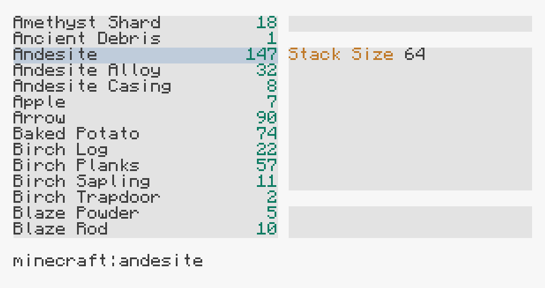
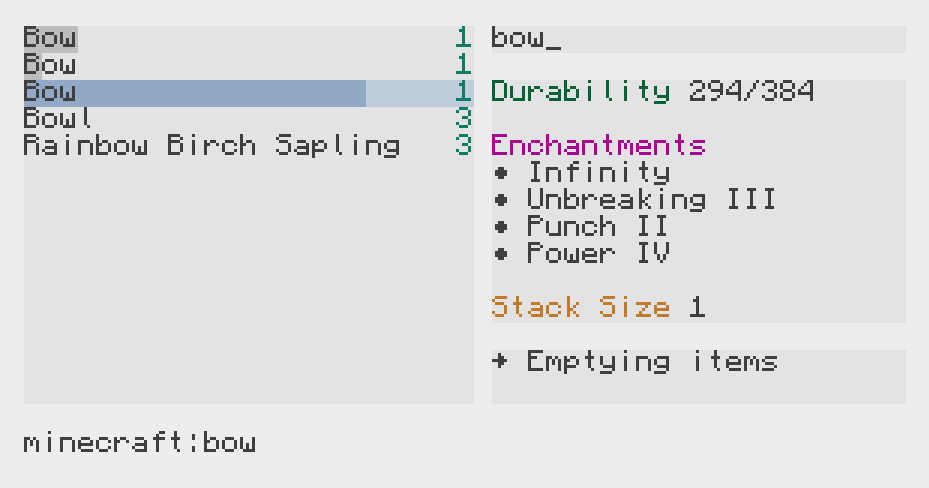

# Maniac Storage
Creating the ✨tech debt✨ I usually have to deal with.

## Why?
I lately play with custom mod packs, where I don't include any source of energy and thus also no AppliedEnergistics or RefinedStorage, which I also feel are sort of OP.
However, manually sorting items and going through chests is *annoying*.\
So I created my own item management system within CC:Tweaked.

Why would *you* use it? *I have absolutely no idea.*\
If you have the same limitations or just avoid AE/RS, but have CC:Tweaked at your capacity, today is your lucky day.

## Client

### Available Items
On the left side is the list of available items, filtered by the current search term.
The amount of available items will be displayed on the right side of each entry.
If an item has taken damage, the entry will reflect this with a damage bar.

### Item Name
In an item is selected, the raw item name (e.g. `minecraft:andesite`) will be displayed on the bottom of the screen.

### Search Bar
During normal operation, the search bar always has focus. Type at any time to filter the list of available items.
The search bar will automatically clear after some time.

The search works similarly to JetBrains' IDEs. A search term consists of one or multiple sub-terms.
The sub-terms are separated by spaces and may match in any order.
> Both `Baked Potato` and `Potato Baked` will match `Baked Potato`

The sub-terms can optionally utilize uppercase letters to match the beginning of words.
> `BPot` will match `Baked Potato`, `BOI` will match `Block of Iron`

The search terms will apply to the item's display name, raw name and enchantments, whereas the search term only has to apply to any of those properties.

### Detail View
The Detail View will provide optional details for the selected item, such as stack size, durability and enchantments.

### Journal View
The Journal View will display the last actions performed, e.g. item extraction, chest emptying and reloading of available items.

### Shortcuts
- `Enter` will open the order prompt for the currently selected item
    - Enter an amount and confirm with `Enter` to order the items or exit without entering anything
- `Ctrl + C` will clear the search bar
- `Pause` will empty the connected chest
- `LAlt` will reload available items from the server
    - This is only necessary, because I have been too lazy to implement an update mechanism yet
- `Arrow Up` will cause the selection to move up one item
    - If no item is selected on the current view, it will jump to the last item
- `Arrow Down` will cause the selection to move down one item
    - If no item is selected on the current view, it will jump to the first item

### Known Issues
- No update mechanism is currently implemented.
  This means if another terminal inserts items into the system, a manual reload will have to be triggered in order for the item to appear on the client.

### Configuration
The client requires a configuration to run. In particular, an input/output inventory and the server's ID are needed.
A sample configuration is provided. The client program will attempt to load `client_configuration.json`.
Please copy the example configuration and adjust it as necesssary.

## Server
The server is entirely defined by its configuration file.
Consult the example configuration as a reference.
All inventories used by the server need to be connected to a wired network connected to the server.

### Inventories
The connected inventories are assumed to be **untouched** by the user.
Removing or inserting items directly into the attached inventories while the system is running results in undefined behavior.
This is because the inventories contents are cached, as each operation on an inventory consumes a game tick.
Due to this, operations are reduced to a minimum and external changes to inventories will not be noticed.

#### Inventory Types
Different inventories behave in slightly different ways.
For example, inserting an item into a chest will always choose the first available slot, regardless of whether an existing stack is present or not.
Due to this, each inventory type will require slightly different caching and insertion/extraction strategies.

The server will automatically detect an inventory type and construct the internal representation accordingly.

#### Additional Configuration Options
In addition to the automatic configuration, the user may enable the following options in the configuration:

- `whitelist`: A list of item filters which are allowed to enter the inventory
- `blacklist`: A list of items not allowed to enter the inventory (mutually exclusive with `whitelist`)
- `disable_limit_check`: If an inventory is full, the system will not attempt to insert items. This can be disabled, e.g. for drawers with avoid upgrade
- `dynamic_whitelist`: Acts the same as `whitelist`, but the allowed items are determined by the items already present in the inventory

### Configuration
The server requires a configuration to run. It will attempt to load `config.json` in the `server` directory.
Please copy the sample configuration and adjust as necessary.